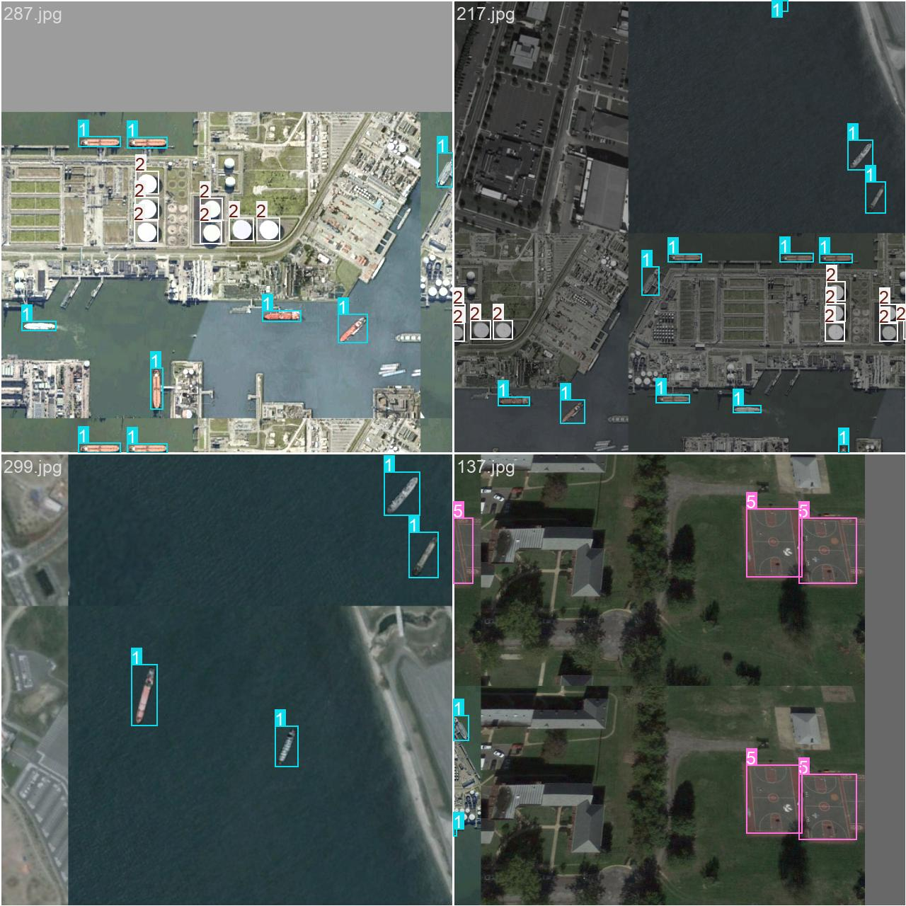

# Satellite Image Object Detection - Results

## Final Results

The project successfully detects objects in satellite images using YOLO models.
Detected objects are visualized with color-coded bounding boxes, numbered badges, and an interactive object list.
The user interface (UI) and FastAPI backend have been developed and tested, and the application can be deployed manually or containerized using Docker for easy distribution and scalability.

### Custom YOLO Model Training Inferences

**Training Result :**  

- The training loss metrics (train/box_loss, train/cls_loss, train/dfl_loss) consistently decrease over the 50 epochs, indicating that the model is effectively learning from the training data.

- The validation loss metrics (val/box_loss, val/cls_loss, val/dfl_loss) also show a general downward trend, although with more fluctuations, suggesting that the model is generalizing well to unseen data without significant overfitting.

- The precision and recall metrics steadily increase throughout the training, reaching high values close to 0.95 and 0.90 respectively, which signifies that the model is accurately identifying positive classes while minimizing false positives and negatives.

- The metrics/mAP50(B) curve shows a strong improvement, starting from around 0.75 and peaking at over 0.90, indicating excellent performance at an IoU threshold of 0.5.

- The metrics/mAP50-95(B) metric, which measures performance across a stricter range of IoU thresholds, also shows a healthy improvement from below 0.5 to around 0.65, demonstrating the model's robustness and accuracy beyond a simple threshold.

### Screenshots

**Screenshot 1:**  

**Screenshot 2:**  

**Screenshot 3:**  

**Screenshot 4:**  

## Challenges Faced

- Preparing the dataset for custom YOLO training was challenging due to image labeling and format conversion.  
- Canvas plotting color contrast with the image background made some detected objects hard to distinguish.  
- Ensuring accurate detection for small or overlapping objects required fine-tuning.  

### Solutions Implemented

- Used proper labeling tools and scripts to convert annotations to YOLO format.  
- Adjusted canvas plotting styles to improve contrast and visibility of detected objects.  
- Tuned model parameters and training configurations to enhance accuracy.  

## Future Improvements

- Preprocessing images to enhance contrast, noise reduction, and edge detection for better results.  
- Implement caching using **MD5 checksums** and previous results for instant responses when the same image is processed again.  
- Queueing detection requests to better utilize computational resources and improve scalability.  
- Explore **contour tracing** instead of bounding boxes for more precise object outlines.  
- Add **multi-scale detection** to better handle objects of varying sizes.  
- Integrate **real-time satellite feed processing** for live detection.  

